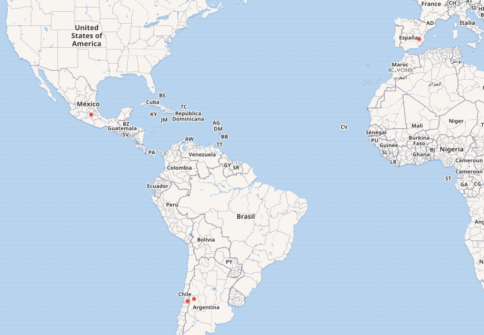

\thispagestyle{empty}
\newpage

\thispagestyle{empty}
\newpage

\thispagestyle{empty}
\setcounter{tocdepth}{4}
\tableofcontents
\newpage

# TP Sparql

## Objetivo pedagógico
Utilizar Sparql para realizar consultas variadas en DBpedia.

## Requerimientos
Para este trabajo se requiere:

- Conexión a Internet para poder acceder al endpoint de DBpedia.

Como referencia para este trabajo, utilice el capítulo 6 (en particular de la sección 6.3 en adelante) del libro "Developers guide to the semantic web"

## Ejercicio 1: ¿Qué es dbpedia?
El siguiente articulo ofrece un panorama general de los aspectos más importantes de dbpedia http://svn.aksw.org/papers/2013/SWJ_DBpedia/public.pdf

Lea el artículo y responda:

1. _¿Qué es dbpedia?_

El proyecto DBpedia consiste en crear una base de conocimientos multilingüe (111 idiomas) a gran escala mediante la extracción de datos estructurados de las distintas ediciones de Wikipedia.

No solo se puede utilizar para responder consultas, sino también es útil en otros dominios de aplicación: 

- la integración de datos
- la detección de temas y la clasificación de documentos
- el reconocimiento de entidades nombradas
- como banco de pruebas dentro de la comunidad científica.

Dado que cubre una amplia variedad de tópicos y establece enlaces RDF que pueden apuntar a fuentes externas, muchos editores han decidido conectar sus propios datos a la base. Por lo tanto, DBpedia se convirtió en un centro de interconexión central en la Web de datos vinculados.

La comunidad de usuarios crea asignaciones desde las estructuras de representación de información de Wikipedia a la ontología DBpedia.

2. _¿De donde sale la información disponible en dbpedia?_

El proyecto extrae conocimientos de 111 ediciones en distintos idiomas de Wikipedia. Puntualmente, el origen más grande es la edición en inglés que consta de más de 400 millones de hechos que describen 3,7 millones de entidades. El resto contribuyen con 1,46 mil millones de hechos y describen 10 millones de objetos adicionales.

DBpedia mapea información de 27 ediciones de Wikipedia en distintos idiomas a una única ontología compartida que consta de 320 clases y 1.650 propiedades.

Además de los lanzamientos regulares, mantiene una base de conocimientos en vivo actualizada cada vez que cambia una página en Wikipedia. DBpedia establece 27 millones de enlaces RDF que apuntan a más de 30 fuentes de datos externas y, por lo tanto, permite que éstos sean parte del todo. 

Varios cientos de conjuntos de datos en la Web publican enlaces RDF y hacen de DBpedia uno de los centros de interconexión central. 

3. _¿Que partes de los artículos de Wikipedia se transforman en tripletas? ¿Qué prefijo utiliza DBpedia para sus propiedes y cuales para los recursos?_

Las partes de los artículos que se transforman en tripletas son los "infoboxes". La idea detrás de éstos es que sean usados para mostrar los hechos mas importantes de un articulo en un formato de clave/valor. Existen distintas plantillas por las cuales son generados, por lo que se simplifica la extracción de la información. 

La alineación entre los "infoboxes" de Wikipedia y la ontología se realiza a través de asignaciones que ayudan a normalizar las variaciones de nombres en propiedades y clases. Un mapeo corresponde un tipo definido en la ontología DBpedia con las entidades que se describen en el "infobox" correspondiente. Y los atributos se asignan a las propiedades de la misma.

Para cada artículo de Wikipedia, el marco presenta una serie de URI para representar los conceptos descritos en una página en particular. 

Hasta 2011, DBpedia publicaba URI solo en el dominio http://dbpedia.org. Y los principales espacios de nombres fueron:

- http://dbpedia.org/resource/ (prefijo dbr) para representar los datos del artículo. Existe un mapeo uno a uno entre una página de Wikipedia y un recurso de DBpedia según el título del artículo.
- http://dbpedia.org/property/ (prefijo dbp) para representar propiedades obtenidas de la extracción de un "infobox" sin formato.
- http://dbpedia.org/ontology/ (prefijo dbo) para representar la ontología DBpedia.

Los recientes desarrollos de internacionalización de DBpedia mostraron que este enfoque omitía datos valiosos. Por tanto, a partir de la versión 6 de DBpedia 3.7, se generaron dos tipos de conjuntos.

Los conjuntos de datos localizados cubren las necesidades para describir un idioma específico. Dentro de ellos, las cosas se identifican con URI específicas del idioma:

- http://<lang>.dbpedia.org/resource/ para datos de artículos.
- http://<lang>.dbpedia.org/property/ para datos de propiedades.

## Ejercicio 2: Realizar consultas Sparql en dbpedia
Para cada caso reporte la consulta sparql correspondiente y el resultado de la misma. En las consultas, de preferencia al uso de clases y propiedades en la ontología de dbpedia (dbo)

1. _Obtener a los escritores que hayan nacido en una ciudad de Argentina._

```sparql
SELECT ?item
WHERE 
{
    ?item rdf:type dbo:Person.
    ?item rdf:type dbo:Writer.
    ?item dbo:birthPlace ?lugar.
    ?lugar rdf:type dbo:City.
    ?lugar dbo:country dbr:Argentina.
}
```

```{r warning=FALSE, echo=FALSE}
library(readr)
library(knitr)
library(kableExtra)
uno <- read_csv("uno.csv", 
    col_types = cols(item.type = col_character(), 
        item.value = col_character()))

column_spec(
  kable_styling(
    kbl(uno, longtable = T, booktabs = T, caption = "Resultado", format="latex"), 
    latex_options = c("striped", "repeat_header", "scale_down" ), font_size = 8, position = "center"),
  2, width = "14cm")
```

2. _Obtener a los escritores que hayan nacido en una ciudad de Uruguay._

```sparql
SELECT ?item
WHERE 
{
    ?item rdf:type dbo:Person.
    ?item rdf:type dbo:Writer.
    ?item dbo:birthPlace ?lugar.
    ?lugar rdf:type dbo:City.
    ?lugar dbo:country dbr:Uruguay.
}
```

```{r warning=FALSE, echo=FALSE}
dos <- read_csv("dos.csv", 
    col_types = cols(item.type = col_character(), 
        item.value = col_character()))

column_spec(
  kable_styling(
    kbl(dos, longtable = T, booktabs = T, caption = "Resultado", format="latex"), 
    latex_options = c("striped", "repeat_header", "scale_down" ), font_size = 8, position = "center"),
  2, width = "14cm")
```

3. _Utilizando el keyword filter (vea sección 6.3.2.6 del libro), obtener a los escritores que hayan nacido en una ciudad de Argentina o de Uruguay_

```sparql
SELECT ?item
WHERE 
{
    ?item rdf:type dbo:Person.
    ?item rdf:type dbo:Writer.
    ?item dbo:birthPlace ?lugar.
    ?lugar rdf:type dbo:City.
    ?lugar dbo:country ?pais.
    FILTER(?pais = dbr:Argentina || ?pais = dbr:Uruguay)
}
```

```{r warning=FALSE, echo=FALSE}
tres <- read_csv("tres.csv", 
    col_types = cols(item.type = col_character(), 
        item.value = col_character()))

column_spec(
  kable_styling(
    kbl(tres, longtable = T, booktabs = T, caption = "Resultado", format="latex"), 
    latex_options = c("striped", "repeat_header", "scale_down" ), font_size = 8, position = "center"),
  2, width = "14cm")
```

4. _Utilizando el keyword union (vea sección 6.3.2.6 del libro), obtener a los escritores que hayan nacido en una ciudad de Argentina o de Uruguay_

```sparql
SELECT *
WHERE 
{
    {
        SELECT ?item
        WHERE 
        {
            ?item rdf:type dbo:Person.
            ?item rdf:type dbo:Writer.
            ?item dbo:birthPlace ?lugar.
            ?lugar rdf:type dbo:City.
            ?lugar dbo:country dbr:Argentina.
        }
    }
    UNION
    {
        SELECT ?item
        WHERE 
        {
            ?item rdf:type dbo:Person.
            ?item rdf:type dbo:Writer.
            ?item dbo:birthPlace ?lugar2.
            ?lugar2 rdf:type dbo:City.
            ?lugar2 dbo:country dbr:Uruguay.
        }
    }
}
```

```{r warning=FALSE, echo=FALSE}
cuatro <- read_csv("cuatro.csv", 
    col_types = cols(item.type = col_character(), 
        item.value = col_character()))

column_spec(
  kable_styling(
    kbl(tres, longtable = T, booktabs = T, caption = "Resultado", format="latex"), 
    latex_options = c("striped", "repeat_header", "scale_down" ), font_size = 8, position = "center"),
  2, width = "14cm")
```


## Ejercicio 3: Llegó Wikidata
Acceda al sitio oficial del proyecto Wikidata: https://www.wikidata.org y leyendo la documentación responda las siguientes preguntas.

1. _¿Qué es wikidata?_

Wikidata es una base de conocimiento colaborativa, libre y abierta que almacena información estructurada. Su principal ventaja es la de ofrecer datos enlazados, descritos mediante RDF, lo cual permite relacionarlos con un conjuntos de datos de otros repositorios digitales.
Wikidata puede ser leída y editada tanto por seres humanos como por máquinas, integrando fuentes de datos publicadas con licencias compatibles con Creative Commons de dominio público (CC-0). Por tanto, todo el contenido puede ser reutilizado por cualquier persona u empresa que así lo desee.

2. _¿De donde sale la información disponible en Wikidata?_

Los datos se obtienen de las siguientes fuentes:

- Wikipedia – Encyclopedia  
- Wiktionary – Dictionary and thesaurus    
- Wikibooks – Textbooks, manuals, and cookbooks   
- Wikinews – News   
- Wikiquote – Collection of quotations    
- Wikisource – Library    
- Wikiversity – Learning resources    
- Wikivoyage – Travel guides    
- Wikispecies – Directory of species   
- Wikimedia Commons – Media repository    
- Incubator – New language versions   
- Meta-Wiki – Wikimedia project coordination   
- MediaWiki – Software documentation   

3. _¿Que partes de los artículos de Wikipedia se transforman en tripletas?_

Cualquier información del articulo puede ser convertido en tripletas. De hecho, como se menciona en [la pagina de Wikimedia](https://meta.wikimedia.org/wiki/Wikidata/Notes/DBpedia_and_Wikidata), mientras que DBpedia extrae la información "semi estructurada" de los "infoboxes" y los expone en tripletas, Wikidata permite generar los "infoboxes" con sus tripletas. Es por esto que la generación de las mismas es "semi manual" mientras que la de DBpedia es mas "automática".

4. _¿Dado el articulo en Wikipedia de "National University of La Plata", como infiero la URL del recurso correspondiente en Wikidata?_

Cuando entramos a la url del recurso (https://es.wikipedia.org/wiki/Universidad_Nacional_de_La_Plata), en la sección inferior podemos encontrar: "Control de Autoridades" donde se dispone el link a Wikidata (https://www.wikidata.org/wiki/Q784171).

 

5. _¿Que diferencias y similitudes encuentra con DBpedia?_

Ambas presentan la información de Wikipedia de una forma estructurada, basada en grafos.

Las principales diferencias para destacar:

- **Dirección del flujo de información**: DBpedia extrae información de Wikipedia, Wikidata la proporciona a Wikipedia.
- **Estructura**: DBpedia hace lo mejor para aplicar estructura a la información textual de Wikipedia, mientras que la información de Wikidata está estructurada de forma nativa para comenzar.
- **Madurez**: DBpedia es más antigua, Wikidata recién está comenzando.
- **Automatizacion**: DBpedia posee un proceso de extracción de información automatizado ya que utiliza los "infoboxes", mientras que Wikidata es semi-automática/dependiente de la comunidad que la mantiene.

## Ejercicio 4: Consultas en Wikidata
1. _Adapte las queries que construyo en los puntos c y d del ejercicio anterior en el endpoint de Wikidata. (https://query.wikidata.org). ¿Obtuvo resultados diferentes? Si la respuesta es si, ¿a que se deben?_

```sparql
# escritores que hayan nacido en una ciudad de Argentina o de Uruguay usando filter
SELECT ?item ?itemLabel
WHERE
{
  ?item wdt:P31 wd:Q5. # instanceof human
  ?item wdt:P106 wd:Q36180. # occupation writer
  ?item wdt:P19 ?lugar. # placeOfBirth 
  ?lugar wdt:P31 wd:Q515. # instanceof city
  ?lugar wdt:P17 ?pais. # country
  SERVICE wikibase:label { bd:serviceParam wikibase:language "en" }
  FILTER(?pais = wd:Q414 || ?pais = wd:Q77) # argentina || uruguay
}
```

```sparql
# escritores que hayan nacido en una ciudad de Argentina o de Uruguay usando union
SELECT * 
WHERE
{
  {
    SELECT ?item ?itemLabel
    WHERE
    {
      ?item wdt:P31 wd:Q5. # instanceof human
      ?item wdt:P106 wd:Q36180. # occupation writer
      ?item wdt:P19 ?lugar. # placeOfBirth 
      ?lugar wdt:P31 wd:Q515. # instanceof city
      ?lugar wdt:P17 wd:Q414. # country argentina
      SERVICE wikibase:label { bd:serviceParam wikibase:language "en" }
    }
  }
  UNION
  {
    SELECT ?item ?itemLabel
    WHERE
    {
      ?item wdt:P31 wd:Q5. # instanceof human
      ?item wdt:P106 wd:Q36180. # occupation writer
      ?item wdt:P19 ?lugar. # placeOfBirth 
      ?lugar wdt:P31 wd:Q515. # instanceof city
      ?lugar wdt:P17 wd:Q77. # country uruguay
      SERVICE wikibase:label { bd:serviceParam wikibase:language "en" }
    }
  }
}

```
A comparación de las queries realizadas en DBpedia, estas devuelven un total de `1796` registros.
Lo que puede deberse no solo a que poseen estructuras de grafos distintas, sino que también Wikidata posee la mayor parte de la Wikipedia mientras que DBpedia no.

2. _Realice una mapa en la que sea posible visualizar los autódromos que se encuentran en una ciudad que esté a mas de 600 metros sobre el nivel del mar._

```sparql
SELECT ?item ?itemLabel ?geo
WHERE 
{
  ?item wdt:P31 wd:Q2338524. # instanceof motorsportRacingTrack
  ?item wdt:P131 ?lugar. # located
  ?item wdt:P625 ?geo. # coordinateLocation
  ?lugar wdt:P31 wd:Q515. # instanceof city
  ?lugar wdt:P2044 ?elevacion. # elevationAboveSeaLevel
  SERVICE wikibase:label { bd:serviceParam wikibase:language "en" }
  FILTER(?elevacion >= 600)
}
```

| item                                     | itemLabel                    | geo                               |
| ---------------------------------------- | ---------------------------- | --------------------------------- |
| http://www.wikidata.org/entity/Q867557   | Circuito de Albacete         | Point(-1.79416667 39.00638889)    |
| http://www.wikidata.org/entity/Q4827227  | Autódromo Jorge Ángel Pena   | Point(-68.49741667 -33.05983333)  |
| http://www.wikidata.org/entity/Q12156002 | Autódromo Las Vizcachas      | Point(-70.52263333 -33.60229167)  |
| http://www.wikidata.org/entity/Q173099   | Autódromo Hermanos Rodríguez | Point(-99.088747222 19.404197222) |

Y en el mapa (agregando: #defaultView:Map en la primera línea de la consulta):

