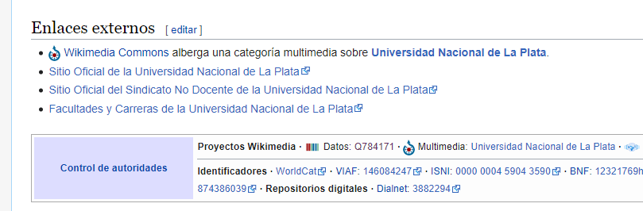

# TP Sparql

## Objetivo pedagógico
Utilizar Sparql para realizar consultas variadas en DBpedia.

## Requerimientos
Para este trabajo se requiere:
- Conexión a Internet para poder acceder al endpoint de DBpedia.

Como referencia para este trabajo, utilice el capítulo 6 (en particular de la sección 6.3 en adelante) del libro "Developers guide to the semantic web"

## Ejercicio 1: ¿Qué es dbpedia?
El siguiente articulo ofrece un panorama general de los aspectos más importantes de dbpedia http://svn.aksw.org/papers/2013/SWJ_DBpedia/public.pdf
Lea el artículo y responda:
1. _¿Qué es dbpedia?_

El proyecto de la comunidad DBpedia extrae conocimiento estructurado y multilingüe de Wikipedia y lo hace libremente disponible en la Web utilizando tecnologías de Web Semántica y Datos Vinculados. Este proyecto es realizado por la Universidad de Leipzig, Universidad Libre de Berlín y la compañía OpenLink Software.

2. _¿De donde sale la información disponible en dbpedia?_

El proyecto extrae conocimiento de 111 diferentes ediciones lingüísticas de Wikipedia. La base de conocimientos más grande de DBpedia que se extrae de la edición en inglés de Wikipedia consta de más de 400 millones de hechos que describen 3,7 millones de cosas. Las bases de conocimiento de DBpedia que se extraen del otro 110 ediciones de Wikipedia juntas constan de 1,46 mil millones de hechos y describen 10 millones de cosas adicionales. 

3. _¿Que partes de los artículos de Wikipedia se transforman en tripletas? ¿Qué prefijo utiliza DBpedia para sus propiedes y cuales para los recursos?_

TODO: falta

## Ejercicio 2: Realizar consultas Sparql en dbpedia
Para cada caso reporte la consulta sparql correspondiente y el resultado de la misma. En las consultas, de preferencia al uso de clases y propiedades en la ontología de dbpedia (dbo) 
1. _Obtener a los escritores que hayan nacido en una ciudad de Argentina._

```sparql
SELECT ?item
WHERE 
{
    ?item rdf:type dbo:Person.
    ?item rdf:type dbo:Writer.
    ?item dbo:birthPlace ?lugar.
    ?lugar rdf:type dbo:City.
    ?lugar dbo:country dbr:Argentina.
}
```

2. _Obtener a los escritores que hayan nacido en una ciudad de Uruguay._

```sparql
SELECT ?item
WHERE 
{
    ?item rdf:type dbo:Person.
    ?item rdf:type dbo:Writer.
    ?item dbo:birthPlace ?lugar.
    ?lugar rdf:type dbo:City.
    ?lugar dbo:country dbr:Uruguay.
}
```

3. _Utilizando el keyword filter (vea sección 6.3.2.6 del libro), obtener a los escritores que hayan nacido en una ciudad de Argentina o de Uruguay_

```sparql
SELECT ?item
WHERE 
{
    ?item rdf:type dbo:Person.
    ?item rdf:type dbo:Writer.
    ?item dbo:birthPlace ?lugar.
    ?lugar rdf:type dbo:City.
    ?lugar dbo:country ?pais.
    FILTER(?pais = dbr:Argentina || ?pais = dbr:Uruguay)
}
```

4. _Utilizando el keyword union (vea sección 6.3.2.6 del libro), obtener a los escritores que hayan nacido en una ciudad de Argentina o de Uruguay_

```sparql
SELECT *
WHERE 
{
    {
        SELECT ?item
        WHERE 
        {
            ?item rdf:type dbo:Person.
            ?item rdf:type dbo:Writer.
            ?item dbo:birthPlace ?lugar.
            ?lugar rdf:type dbo:City.
            ?lugar dbo:country dbr:Argentina.
        }
    }
    UNION
    {
        SELECT ?item
        WHERE 
        {
            ?item rdf:type dbo:Person.
            ?item rdf:type dbo:Writer.
            ?item dbo:birthPlace ?lugar2.
            ?lugar2 rdf:type dbo:City.
            ?lugar2 dbo:country dbr:Uruguay.
        }
    }
}
```


## Ejercicio 3: Llegó Wikidata
Acceda al sitio oficial del proyecto Wikidata: https://www.wikidata.org y leyendo la documentación responda las siguientes preguntas.
1. _¿Qué es wikidata?_

Wikidata es una base de conocimiento colaborativa, libre y abierta que almacena información estructurada. Su principal ventaja es que ofrece datos enlazados, descritos mediante RDF, lo cual permite relacionarlos con otros conjuntos de datos de otros repositorios digitales.
Wikidata puede ser leída y editada tanto por seres humanos como por máquinas, integrando fuentes de datos publicadas con licencias compatibles con Creative Commons de dominio público (CC-0). Por tanto, todo el contenido puede ser reutilizado por cualquier persona u empresa que así lo desee.

2. _¿De donde sale la información disponible en Wikidata?_

Los datos se obtienen de las siguientes fuentes:
- Wikipedia – Encyclopedia  
- Wiktionary – Dictionary and thesaurus    
- Wikibooks – Textbooks, manuals, and cookbooks   
- Wikinews – News   
- Wikiquote – Collection of quotations    
- Wikisource – Library    
- Wikiversity – Learning resources    
- Wikivoyage – Travel guides    
- Wikispecies – Directory of species   
- Wikimedia Commons – Media repository    
- Incubator – New language versions   
- Meta-Wiki – Wikimedia project coordination   
- MediaWiki – Software documentation   

3. _¿Que partes de los artículos de Wikipedia se transforman en tripletas?_
4. _¿Dado el articulo en Wikipedia de "National University of La Plata", como infiero la URL del recurso correspondiente en Wikidata?_

Cuando entramos a la url del recurso (https://es.wikipedia.org/wiki/Universidad_Nacional_de_La_Plata), en la seccion inferior podemos encontrar una seccion "Control de Autoridades" donde se encuentra el link a Wikidata (https://www.wikidata.org/wiki/Q784171).

 

5. _¿Que diferencias y similitudes encuentra con DBpedia?_

Estas son algunas de las principales diferencias para destacar:
- **Dirección del flujo de información**: DBpedia extrae información de Wikipedia, Wikidata la proporciona a Wikipedia.
- **Estructura**: DBpedia hace lo mejor para aplicar estructura a la información textual de Wikipedia, mientras que la información de Wikidata está estructurada de forma nativa para comenzar.
- **Madurez**: DBpedia es más antigua, Wikidata recién está comenzando
- **Notabilidad**: DBpedia hereda el sentido de "notoriedad" blanco, occidental y masculino de Wikipedia, mientras que Wikidata no tiene reglas de notoriedad (todavía, y las Wikipedias pueden optar por no incluir información de Wikidata que no crean que califique como "notable")

## Ejercicio 4: Consultas en Wikidata
1. _Adapte las queries que construyo en los puntos c y d del ejercicio anterior en el endpoint de Wikidata. (https://query.wikidata.org). ¿Obtuvo resultados diferentes? Si la respuesta es si, ¿a que se deben?_

```sparql
# escritores que hayan nacido en una ciudad de Argentina o de Uruguay usando filter
SELECT ?item ?itemLabel
WHERE
{
  ?item wdt:P31 wd:Q5. # instanceof human
  ?item wdt:P106 wd:Q36180. # occupation writer
  ?item wdt:P19 ?lugar. # placeOfBirth 
  ?lugar wdt:P31 wd:Q515. # instanceof city
  ?lugar wdt:P17 ?pais. # country
  SERVICE wikibase:label { bd:serviceParam wikibase:language "en" }
  FILTER(?pais = wd:Q414 || ?pais = wd:Q77) # argentina || uruguay
}
```

```sparql
# escritores que hayan nacido en una ciudad de Argentina o de Uruguay usando union
SELECT * 
WHERE
{
  {
    SELECT ?item ?itemLabel
    WHERE
    {
      ?item wdt:P31 wd:Q5. # instanceof human
      ?item wdt:P106 wd:Q36180. # occupation writer
      ?item wdt:P19 ?lugar. # placeOfBirth 
      ?lugar wdt:P31 wd:Q515. # instanceof city
      ?lugar wdt:P17 wd:Q414. # country argentina
      SERVICE wikibase:label { bd:serviceParam wikibase:language "en" }
    }
  }
  UNION
  {
    SELECT ?item ?itemLabel
    WHERE
    {
      ?item wdt:P31 wd:Q5. # instanceof human
      ?item wdt:P106 wd:Q36180. # occupation writer
      ?item wdt:P19 ?lugar. # placeOfBirth 
      ?lugar wdt:P31 wd:Q515. # instanceof city
      ?lugar wdt:P17 wd:Q77. # country uruguay
      SERVICE wikibase:label { bd:serviceParam wikibase:language "en" }
    }
  }
}
```

2. Realice una mapa en la que sea posible visualizar los autódromos que se encuentran en una ciudad que esté a mas de 600 metros sobre el nivel del mar.
